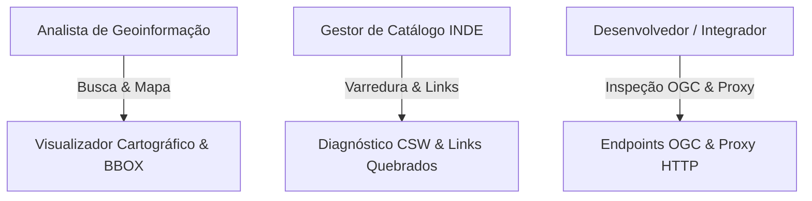
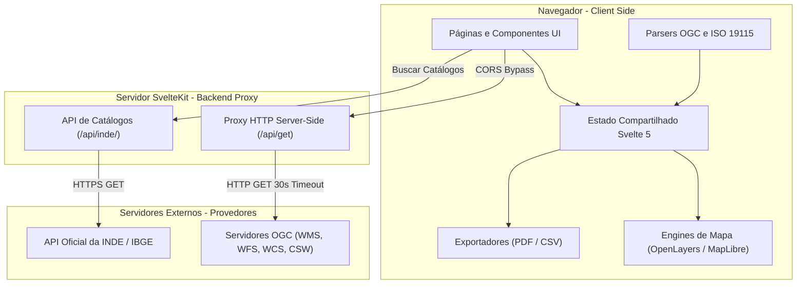

# Product Requirements Document (PRD) — DBDG INDE

> **Sistema de Descoberta, Busca, Diagnóstico e Geo-visualização da INDE**  
> **Versão:** 1.0.0  
> **Data:** Agosto / 2026  
> **Status:** Em Desenvolvimento Ativo  
> **Stack:** SvelteKit 2, Svelte 5 (Runes), TypeScript 5, Tailwind CSS 4, OpenLayers 10, MapLibre GL 5  

---

## 1. Visão Geral do Produto

O **DBDG INDE** é uma aplicação web moderna construída para catalogação, consulta, análise, inspeção de metadados e visualização interativa de geosserviços padronizados pela **OGC (Open Geospatial Consortium)** e publicados no âmbito da **Infraestrutura Nacional de Dados Espaciais (INDE)** e do **IBGE**.

A aplicação atua como um agregador e cliente leve (*stateless*), simplificando a descoberta de camadas **WMS**, tipos de feições **WFS**, coberturas **WCS** e registros de metadados **CSW (ISO 19115)**, além de fornecer diagnósticos de saúde de links e qualidade da informação espacial disponibilizada por órgãos governamentais.

---

## 2. Objetivos e Impacto

### 2.1 Objetivos Principais
- **Descoberta Centralizada:** Facilitar a busca e inventário de geosserviços em centenas de catálogos da INDE sem necessidade de software GIS desktop (como QGIS).
- **Inspeção e Validação:** Analisar documentos de capacidades (`GetCapabilities`) e metadados (`ISO 19115`) extraindo palavras-chave, restrições, contatos, resumos e limites geográficos (BBOX).
- **Diagnóstico da Qualidade:** Identificar automaticamente links quebrados, endpoints indisponíveis e inconsistências nos registros CSW.
- **Visualização Integrada:** Prover mapas web de alta performance (via OpenLayers e MapLibre GL) para visualização e sobreposição de camadas espaciais e feições vetoriais.
- **Exportação de Relatórios:** Permitir a geração de inventários em formato CSV e relatórios de diagnósticos formatados em PDF.

### 2.2 Problema Resolvido
Atualmente, pesquisadores, gestores e analistas GIS enfrentam dificuldades para descobrir quais dados espaciais estão ativos na INDE, enfrentam lentidão em buscas manuais de metadados e necessitam de ferramentas pesadas para checar se as URLs dos serviços estão operacionais. O DBDG INDE unifica esse fluxo diretamente no navegador.

---

## 3. Personas e Casos de Uso



### 3.1 Personas
1. **Analista de Geoinformação / Pesquisador:** Necessita encontrar dados específicos sobre áreas geográficas ou temas (ex: meio ambiente, demografia), inspecionar atributos e sobrepor camadas no mapa.
2. **Gestor de Catálogo / Auditor INDE:** Precisa monitorar a disponibilidade dos nós da INDE, contabilizar palavras-chave e identificar links corrompidos ou inacessíveis em metadados.
3. **Desenvolvedor / Integrador GIS:** Precisa inspecionar retornos XML/JSON OGC, testar endpoints e validar esquemas XSD/WFS.

---

## 4. Escopo do Produto

### 4.1 Dentro do Escopo (In-Scope)
- ✅ Suporte completo aos padrões OGC: **WMS (1.1.1/1.3.0)**, **WFS (1.1.0/2.0.0)**, **WCS (1.0.0/2.0.1)** e **CSW (2.0.2)**.
- ✅ Parser e exibição legível de metadados na norma **ISO 19115 / ISO 19139**.
- ✅ Proxy HTTP backend (SvelteKit server endpoints) com suporte a contorno de restrições CORS.
- ✅ Filtros avançados por busca textual, espacial (Bounding Box / BBOX) e estado de metadados.
- ✅ Agregação estatística de palavras-chave por nó/catálogo.
- ✅ Módulo de diagnósticos de URLs (Links Quebrados em registros CSW).
- ✅ Visualizadores webGIS com OpenLayers 10 e MapLibre GL 5 (com suporte a Proj4 e deck.gl experimental).
- ✅ Exportação de dados para relatórios **PDF** e planilhas **CSV**.

### 4.2 Fora do Escopo (Out-of-Scope)
- ❌ Autenticação, gestão de usuários e controle de permissões (RBAC).
- ❌ Edição, criação ou vetorização de dados espaciais (ferramenta somente de leitura / consulta).
- ❌ Persistência em banco de dados relacional próprio (aplicação opera em modelo *stateless* e sessão client-side).
- ❌ Garantia de disponibilidade ou correção de falhas nos servidores de terceiros da INDE/IBGE.

---

## 5. Arquitetura do Sistema e Fluxo de Dados

### 5.1 Visão Geral da Arquitetura

O DBDG INDE adota uma arquitetura em camadas desacopladas com separação clara entre a **Interface de Usuário (Client-Side)**, a **Camada de Orquestração e Transporte Backend (Server-Side Proxy)** e os **Servidores de Terceiros da INDE/IBGE/OGC**.

#### Diagrama de Arquitetura Conceitual




#### Detalhamento das Camadas Arquiteturais

| Camada | Responsabilidade | Principais Módulos / Caminhos |
| :--- | :--- | :--- |
| **Apresentação (UI)** | Renderização de telas, formulários de filtro, cartões de inventário e estados visuais de carregamento. | `src/routes/`<br>`src/lib/components/` |
| **Estado Compartilhado** | Gerenciamento reativo do catálogo ativo, camadas selecionadas, BBOX e filtros usando Svelte 5 Runes (`$state`, `$derived`). | `src/lib/shared/` |
| **Parsers & Domínio OGC** | Leitura de documentos XML/JSON (Capabilities WMS/WFS/WCS, ISO 19115 e registros CSW), normalizando-os em modelos TypeScript. | `src/lib/ogc/`<br>`src/lib/metadata/` |
| **Cartografia & Renderização** | Sobreposição de camadas WMS/WFS, controle de opacidade, legibilidade gráfica e mapas-base. | `src/lib/components/openlayers/`<br>`src/lib/components/map_libre/` |
| **Saída & Relatórios** | Construção no cliente de documentos PDF formatados e planilhas CSV em UTF-8. | `src/lib/components/pdf/`<br>`src/lib/components/csv/` |
| **Transporte & Proxy HTTP** | Bypass de restrições CORS do navegador, controle de timeout de 30s e repasse de cabeçalhos. | `src/routes/api/get/+server.ts`<br>`src/lib/request/` |

#### Fluxo de Dados End-to-End
1. **Solicitação:** O usuário solicita a consulta de um nó OGC (ex: `GetCapabilities` WMS ou busca CSW).
2. **Intermediação (Proxy):** A requisição é encaminhada para o endpoint interno `/api/get?url=...`, evitando bloqueios de CORS do navegador.
3. **Parseamento & Normalização:** A resposta XML retornada é processada pelos parsers tipados em `src/lib/ogc/` e convertida em objetos TypeScript.
4. **Reatividade de Estado:** Os objetos alimentam o estado reativo compartilhado em `src/lib/shared/`.
5. **Apresentação & Ações:** A UI atualiza os cartões de inventário e disponibiliza ações para visualização no mapa (OpenLayers) ou exportação de relatórios (PDF/CSV).


### 5.2 Decisões Tecnológicas (Stack)
- **Framework:** [SvelteKit 2](https://kit.svelte.dev/) + [Svelte 5](https://svelte.dev/) (usando Runes `$state`, `$derived`, `$effect`).
- **Linguagem:** TypeScript 5 (tipagem estrita nos parsers e modelos de domínio).
- **Estilização:** Tailwind CSS 4 + Flowbite Svelte + Flowbite Icons.
- **Visualização Cartográfica:** OpenLayers 10, MapLibre GL 5, deck.gl 9, Proj4.js.
- **Relatórios:** jsPDF e exportadores CSV customizados.

---

## 6. Requisitos Funcionais

### 6.1 Catálogo e Navegação Institucional
| ID | Requisito | Descrição | Status |
| :--- | :--- | :--- | :--- |
| **RF-001** | Navegação por Módulos | A aplicação deve fornecer menu navegável para as áreas WMS, WFS, WCS, CSW, Visualizador e Diagnósticos. | `Implementado` |
| **RF-002** | Catálogos INDE | Consumir a API da INDE para listar organizações e seus respectivos endpoints WMS/WFS/WCS. | `Implementado` |
| **RF-003** | Catálogos IBGE | Oferecer lista especializada de serviços e metadados do IBGE organizados por temas. | `Implementado` |
| **RF-004** | Adição Manual de Endpoint | Permitir que o usuário insira URLs customizadas de serviços OGC para análise pontual na sessão. | `Implementado` |

### 6.2 Proxy HTTP & Segurança de Transporte
| ID | Requisito | Descrição | Status |
| :--- | :--- | :--- | :--- |
| **RF-005** | Proxy Server-Side | Intermediar requisições GET HTTP/HTTPS para contornar políticas de CORS do navegador. | `Implementado` |
| **RF-006** | Timeout & Validação | Aplicar limite de timeout configurado (30s) e rejeitar esquemas inválidos/não seguros. | `Implementado` |
| **RF-007** | Repasse de Headers | Manter `Content-Type` e códigos HTTP retornados pelos servidores de origem. | `Implementado` |

### 6.3 Módulo WMS (Web Map Service)
| ID | Requisito | Descrição | Status |
| :--- | :--- | :--- | :--- |
| **RF-008** | WMS GetCapabilities | Efetuar o parse de documentos `GetCapabilities` XML (WMS 1.1.1 e 1.3.0). | `Implementado` |
| **RF-009** | Inventário Hierárquico | Exibir árvore de camadas WMS mostrando Título, Nome, Resumo, CRS, Estilos e Metadados. | `Implementado` |
| **RF-010** | Filtro e Pesquisa | Filtrar camadas por busca textual e por disponibilidade de metadados vinculados. | `Implementado` |
| **RF-011** | Agregação de Keywords | Contabilizar e ranquear palavras-chave declaradas nas camadas WMS dos nós selecionados. | `Implementado` |
| **RF-012** | Busca por BBOX | Selecionar camadas WMS cuja extensão geográfica intercepte uma BBOX desenhada no mapa. | `Implementado` |
| **RF-013** | Legenda e Visualização | Carregar graficamente a legenda (`GetLegendGraphic`) e adicionar a camada ao OpenLayers. | `Implementado` |

### 6.4 Módulo WFS (Web Feature Service)
| ID | Requisito | Descrição | Status |
| :--- | :--- | :--- | :--- |
| **RF-014** | WFS GetCapabilities | Interpretar documentos `GetCapabilities` WFS e listar os Feature Types disponíveis. | `Implementado` |
| **RF-015** | DescribeFeatureType | Consultar o esquema XSD da feição para apresentar nome, tipo e restrição dos atributos. | `Implementado` |
| **RF-016** | Carregamento Vetorial | Adicionar feições WFS em camada vetorial interativa com suporte a popups de atributos. | `Implementado` |

### 6.5 Módulo WCS (Web Coverage Service)
| ID | Requisito | Descrição | Status |
| :--- | :--- | :--- | :--- |
| **RF-017** | WCS GetCapabilities | Listar dados de coberturas matriciais (raster), seus formatos de saída e bounding boxes. | `Implementado` |
| **RF-018** | Construtor de Requisições | Gerar URLs de consulta `DescribeCoverage` e `GetCoverage` com parâmetros selecionados. | `Implementado` |

### 6.6 Módulo CSW & Metadados (ISO 19115)
| ID | Requisito | Descrição | Status |
| :--- | :--- | :--- | :--- |
| **RF-019** | Varredura CSW | Executar buscas paginadas (`GetRecords`) em catálogos CSW da INDE. | `Implementado` |
| **RF-020** | Parser ISO 19115 | Extrair e formatar identificador, título, resumo, palavras-chave, contatos, BBOX e distribuição. | `Implementado` |
| **RF-021** | Diagnóstico de Links | Verificar a conectividade das URLs cadastradas nos registros de metadados, identificando erros 404/500. | `Implementado` |

### 6.7 Visualizador Cartográfico (WebGIS)
| ID | Requisito | Descrição | Status |
| :--- | :--- | :--- | :--- |
| **RF-022** | Renderizador OpenLayers | Mapa interativo com suporte a basemaps (OSM, CartoDB), controle de zoom e medições. | `Implementado` |
| **RF-023** | Gestão de Camadas | Adicionar, remover, reordenar e ajustar opacidade de camadas WMS/WFS ativas. | `Implementado` |
| **RF-024** | Renderizador MapLibre | Motor alternativo de mapa para testes de performance e renderização em vetores. | `Parcial` |

### 6.8 Exportação de Dados & Relatórios
| ID | Requisito | Descrição | Status |
| :--- | :--- | :--- | :--- |
| **RF-025** | Exportação CSV | Exportar inventários de camadas, palavras-chave e lista de links testados em CSV (UTF-8). | `Implementado` |
| **RF-026** | Relatório PDF | Gerar relatório formatado em PDF contendo estatísticas e detalhamento do metadado inspecionado. | `Implementado` |

---

## 7. Requisitos Não-Funcionais (RNFs)

- **RNF-001 (Compatibilidade):** Compatível com Node.js 20+ e executável nos principais navegadores modernos (Chrome, Firefox, Edge, Safari).
- **RNF-002 (Responsividade):** Layout adaptável para resoluções Desktop e Tablet/Mobile utilizando breakpoints do Tailwind CSS.
- **RNF-003 (Interoperabilidade):** Estrita aderência às especificações OGC (WMS 1.1/1.3, WFS 1.1/2.0, WCS 1.0/2.0, CSW 2.0.2 e ISO 19115).
- **RNF-004 (Desempenho e Resiliência):** As operações de rede longas (como varreduras CSW) devem possuir indicação de *loading*, tratamento de exceções sem travar a UI e opção de cancelamento.
- **RNF-005 (Mitigação de SSRF no Proxy):** O proxy backend deve validar domínios, impedir requisições a redes privadas/localhost e aplicar timeout rígido.

---

## 8. Mapa de Navegação e Rotas

```
/
├── /servicos                              (Listagem de serviços da API INDE)
├── /ogc
│   ├── /wms
│   │   ├── /catalogos                     (Inventário e capacidades WMS)
│   │   ├── /capabilities                  (Filtros e árvore de camadas)
│   │   └── /palavras-chaves               (Estatísticas de palavras-chave)
│   ├── /wfs
│   │   ├── /catalogos                     (Inventário e métricas WFS)
│   │   ├── /capabilities                  (Lista e filtro de Feature Types)
│   │   ├── /tipo-de-feicoes               (Inspeção detalhada de feição)
│   │   └── /schema-feature-type           (Detalhes do esquema XSD)
│   ├── /wcs
│   │   └── /catalogos                     (Análise de coberturas WCS)
│   └── /csw
│       ├── /catalogos                     (Seleção de nós CSW)
│       ├── /metadados                     (Navegação e busca em registros)
│       ├── /links-quebrados               (Configuração de teste de links)
│       └── /links-quebrados/result        (Resultado e diagnósticos)
└── /visualizador
    ├── /ol                                (Visualizador principal OpenLayers)
    ├── /metadata                          (Visualizador de documento ISO 19115)
    └── /maplibre                          (Visualizador alternativo MapLibre GL)
```

---

## 9. Riscos, Débitos Técnicos e Recomendações

1. **Proteção contra SSRF:** O endpoint `/api/get` aceita URLs arbitrárias. Recomenda-se implementar uma *allowlist* de domínios confiáveis da INDE/IBGE ou proibir blocos de IP privados (10.0.0.0/8, 192.168.0.0/16, etc.).
2. **Dependência de Terceiros:** A aplicação depende da estabilidade e velocidade dos servidores dos órgãos da INDE. Recomenda-se adicionar mecanismo de cache de curta duração para `GetCapabilities`.
3. **Limpeza de Rotas Experimentais:** Isolar as rotas legadas/protótipos (`/deckgl`, `/teste`, `/xml`) da build de produção para evitar ambiguidades.
4. **Testes Automatizados:** Desenvolver suíte de testes unitários (Vitest) para os parsers de XML/OGC e testes de ponta a ponta (Playwright) para o fluxo cartográfico.

---

## 10. Critérios de Aceite para Release

1. **Parsing Robusto:** Todos os parsers (WMS, WFS, WCS, CSW) devem ser testados e aprovados contra ao menos 5 provedores distintos da INDE.
2. **Build sem Erros:** O projeto deve passar nos comandos `npm run check` (Svelte Check / TypeScript) e `npm run build` sem avisos críticos ou falhas.
3. **Exportação Funcional:** Os relatórios em PDF e arquivos CSV gerados devem conter acentuação correta e formatar adequadamente caracteres especiais em UTF-8.
4. **Sem Vazamento de Memória:** Adicionar e remover 20 camadas consecutivas no OpenLayers não deve causar congelamento ou travamento da aba do navegador.
